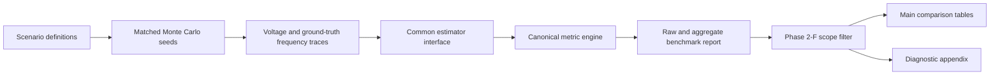

# Phase 2-J Methods and Experimental Setup draft

Date: 2026-06-10

This file drafts the Methods/Experimental Setup section that should precede the
Phase 2-I Results draft. Its purpose is to explain the Phase 2-G evidence
contract, the estimator/scenario matrix, the metric profile, and the Phase 2-F
main-vs-diagnostic scope filter before any result is interpreted.

## Mini-outline

1. Define OpenFreqBench as the reproducible evaluation protocol.
2. Describe the signal, Monte Carlo, and parameter contracts.
3. Define the scenario matrix and estimator families.
4. Define the canonical metric profile and manuscript-facing metric subset.
5. Explain the post-startup invalid-output rule and report filtering.
6. Describe report generation, confidence intervals, and traceability artifacts.
7. State the limits of the Phase 2-G protocol before Results.

## Pre-writing module map

| Module | How it runs | Why it is needed | Why it works |
| --- | --- | --- | --- |
| Scenario generator | Each scenario produces voltage samples and a ground-truth frequency trajectory under matched Monte Carlo seeds. | Estimators must be compared under identical disturbances rather than ad hoc signals. | Shared seeds make estimator comparisons paired within each scenario. |
| Estimator adapter | Each estimator exposes `step(...)` or `step_vectorized(...)` and is invoked through the same runner. | Runtime, invalid outputs, and accuracy must be measured through one interface. | The common adapter prevents estimator-specific evaluation scripts from changing the protocol. |
| Metric engine | The canonical profile computes accuracy, tail-error, risk, latency, timing, startup, and invalid-output metrics. | Frequency estimators fail in more ways than average RMSE. | Separating accuracy, tail behavior, latency, and validity exposes different failure modes. |
| Scope filter | Pairs with post-startup invalid outputs or non-finite RMSE are moved to a diagnostic appendix. | Main tables should not rank invalid outputs as ordinary accuracy values. | The raw artifact remains complete, while manuscript rankings use only defensible main-comparison pairs. |
| Report builder | The report writes summary tables, plots, traceability files, and evidence manifests from `benchmark_report.json`. | The manuscript needs auditable tables rather than hand-copied results. | Every table is regenerated from the same serialized evidence bundle. |

## Pipeline sketch



## Draft Methods / Experimental Setup

### 1. Benchmark Protocol

[Overview] We evaluate frequency estimators with OpenFreqBench, a reproducible
single-phase benchmark protocol that maps scenario definitions, estimator
interfaces, metric computation, and report generation into one serialized
evidence bundle. The active profile is `canonical-single-phase-v1`, which uses a
single-phase voltage signal and its ground-truth frequency trajectory as the
common input/output contract. This section defines the protocol used for the
Phase 2-G evidence layer; it does not reuse numerical claims from the earlier
SGSMA presented-paper artifact.

[Design] For each scenario-estimator pair, OpenFreqBench generates a voltage
trace, applies the estimator through the common runner, computes the canonical
metrics, and stores both per-run and aggregate records. The Phase 2-G run uses
the configuration `configs/phase2-paper-grade.yaml`, with run identifier
`phase2-paper-grade`, `n_runs=30`, `base_seed=20260609`,
`parameter_policy=default`, `max_workers=1`, and `capture_signals=false`. The
resulting report contains 7140 raw Monte Carlo records from 238
scenario-estimator pairs.

### 2. Signal and Monte Carlo Contract

[Design] Each scenario returns a benchmark-facing signal sampled at 10 kHz
(`dt=1e-4 s`) and a ground-truth frequency sequence. Every estimator receives
the same voltage sample sequence and, when needed, the corresponding timestamp.
This common signal contract ensures that differences in output metrics come from
the estimator and not from scenario-specific preprocessing.

[Design] Monte Carlo replication uses matched seeds across estimators. For run
index `i`, the scenario seed is `base_seed + i`, where `base_seed=20260609` in
Phase 2-G. The same sampled scenario realization is therefore available to every
estimator in a given scenario and run index. This paired design reduces one
source of comparison noise and makes scenario-estimator differences easier to
interpret.

### 3. Scenario Matrix

[Design] The Phase 2-G matrix contains 14 scenarios grouped into nine scenario
families. The matrix includes nominal sinusoidal behavior, frequency steps,
frequency ramps, magnitude steps, phase jumps, modulation, out-of-band
interference, harmonics, and IBR multi-event stress. This mix is intentionally
not a full grid-event taxonomy; it is the clean paper-grade matrix used for the
first post-SGSMA evidence layer.

Candidate Table 1. Phase 2-G scenario families.

| Scenario family | Scenarios | Count |
| --- | --- | ---: |
| frequency_step | `IEEE_Freq_Step` | 1 |
| harmonics | `IBR_Harmonics_Medium` | 1 |
| ibr_event | `IBR_Multi_Event` | 1 |
| magnitude_step | `IEEE_Mag_Step_25pct`, `IEEE_Mag_Step_5pct` | 2 |
| modulation | `IEEE_Modulation_AM`, `IEEE_Modulation_FM` | 2 |
| nominal | `IEEE_Single_SinWave` | 1 |
| oob_interference | `IEEE_OOB_Interference` | 1 |
| phase_jump | `IEEE_Phase_Jump_20`, `IEEE_Phase_Jump_60`, `NERC_Phase_Jump_60` | 3 |
| rocof_ramp | `IEEE_Freq_Ramp_10Hzs`, `IEEE_Freq_Ramp_1Hzs` | 2 |

### 4. Estimator Matrix

[Design] The Phase 2-G estimator matrix contains 17 estimators grouped into five
families: adaptive, data-driven, loop-based, model-based, and window-based. The
configuration uses each estimator's default parameter policy rather than
artifact-tuned per-scenario parameters. This makes the run a fixed clean
baseline for manuscript analysis, not a tuned leaderboard.

Candidate Table 2. Phase 2-G estimator families.

| Estimator family | Estimators | Count |
| --- | --- | ---: |
| Adaptive | `RLS`, `TKEO` | 2 |
| Data-driven | `Koopman (RK-DPMU)` | 1 |
| Loop-based | `PLL`, `SOGI-FLL`, `SOGI-PLL`, `Type-3 SOGI-PLL`, `ZCD` | 5 |
| Model-based | `EKF`, `LKF`, `LKF2`, `RA-EKF`, `UKF` | 5 |
| Window-based | `ESPRIT`, `IPDFT`, `Prony`, `TFT` | 4 |

### 5. Metric Profile

[Design] Metrics are computed by the platform-owned canonical metric engine, not
by formulas embedded in YAML files. The Phase 2-G configuration locks the
profile to `canonical-single-phase-v1` and declares a manuscript-facing metric
subset covering average accuracy, tail error, protection relevance, timing,
latency, startup behavior, and invalid-output behavior. The serialized report
also retains canonical-profile fields for traceability.

Candidate Table 3. Manuscript-facing metric subset.

| Metric ID | Role in the paper |
| --- | --- |
| `m1_rmse_hz` | Primary average frequency-error metric. |
| `m2_mae_hz` | Secondary average absolute-error metric. |
| `m3_max_peak_hz` | Worst-case peak frequency error. |
| `m5_trip_risk_s` | Protection-oriented accumulated risk time. |
| `m7_pcb_hz` | Probabilistic compliance-bound style error metric. |
| `m13_cpu_time_us` | Diagnostic CPU timing context. |
| `m14_struct_latency_ms` | Declared structural estimator latency. |
| `m21_startup_valid_samples` | Number of startup samples before first finite output. |
| `m22_invalid_output_rate` | Total invalid-output rate, including startup invalids. |
| `m36_post_startup_invalid_rate` | Invalid-output rate after the first finite estimator output. |
| `m34_p95_error_hz` | 95th-percentile error magnitude. |
| `m35_p99_error_hz` | 99th-percentile error magnitude. |

[Motivation] The post-startup invalid-output metric is necessary because
windowed estimators can validly return `NaN` during structural startup latency.
Counting those startup values as ordinary failures would overstate failures for
windowed methods; ignoring invalid outputs after startup would hide estimator
breakdown. The protocol therefore keeps both quantities: `m22_invalid_output_rate`
for total invalid output and `m36_post_startup_invalid_rate` for paper-level
failure interpretation.

### 6. Main-Comparison and Diagnostic-Appendix Filter

[Design] The manuscript tables use a deterministic Phase 2-F scope filter. A
scenario-estimator pair is moved to the diagnostic appendix if it has
`m36_post_startup_invalid_rate > 0` or if RMSE is non-finite in any run for that
pair. Otherwise, the pair remains eligible for the main comparison. The filter
does not delete data: raw records, aggregate records, traceability files, and
diagnostic tables remain available in the artifact bundle.

[Advantage] This scope filter makes the Results section more defensible because
it separates estimator validity from estimator accuracy. Main tables answer
"which estimator is accurate when the estimator produces valid post-startup
outputs?" Diagnostic tables answer "where does an estimator fail to produce
valid post-startup outputs?" This separation is especially important for Prony,
which has four diagnostic appendix pairs in the Phase 2-G report.

### 7. Report Generation and Statistical Summaries

[Design] The runner writes `benchmark_report.json`, `raw_run_records.csv`,
`aggregated_metrics.csv`, `artifact_index.csv`, `paper_traceability.csv`,
`evidence_manifest.json`, and `environment_report.json`. The report builder then
generates manuscript-facing tables and plots under
`artifacts/openfreqbench/phase2-paper-grade/report-phase2f/`. Confidence
intervals use nonparametric bootstrap intervals over per-run estimator means
with fixed bootstrap seed 12345.

[Limitation] CPU timing is reported as diagnostic context in Phase 2-G. The run
used `BENCHMARK_N_COST_REPS=1`, so timing values can support qualitative
decision-support discussion but should not be promoted to journal-grade CPU
ranking claims. A dedicated timing run with a stronger repeated-cost protocol is
required before making central CPU-ranking claims.

### 8. Reproducibility and Traceability

[Design] The experiment is reproducible from the committed YAML configuration
and the serialized artifact bundle. The report records the run identifier, seed,
parameter policy, metric profile, selected scenarios, selected estimators,
environment report, artifact index, and evidence manifest. The manuscript should
cite `benchmark_report.json` and regenerated report tables rather than manually
copied screenshots or old SGSMA artifacts.

[Scope] Phase 2-G does not support PI-GRU generalization claims, ATLAS
severity-sweep claims, or n=100 journal-grade uncertainty claims. PI-GRU is not
included in the 17-estimator matrix, ATLAS severity sweeps are not part of this
fixed OpenFreqBench matrix, and the Monte Carlo count is 30 rather than 100.
These exclusions define the evidence boundary for the Results section.

## Candidate LaTeX structure

```latex
\section{Experimental Setup}
\subsection{Benchmark Protocol}
\subsection{Signal and Monte Carlo Contract}
\subsection{Scenario and Estimator Matrix}
\subsection{Metrics and Validity Gate}
\subsection{Report Generation and Statistical Summaries}
\subsection{Reproducibility Boundary}
```

## Claim-Evidence Map

| Methods statement | Evidence |
| --- | --- |
| Phase 2-G uses 14 scenarios, 17 estimators, 238 pairs, and 7140 records. | `configs/phase2-paper-grade.yaml`; `analysis_summary.md`; `PHASE2G_PAPER_GRADE_30SEED.md` |
| The run uses 30 Monte Carlo seeds with base seed 20260609. | `configs/phase2-paper-grade.yaml`; `benchmark_report.json` |
| The estimator matrix uses the default parameter policy. | `configs/phase2-paper-grade.yaml`; `benchmark_report.json` |
| Signal capture is disabled for the paper-grade run. | `configs/phase2-paper-grade.yaml`; `benchmark_report.json` |
| Main comparison uses 234 pairs and diagnostic appendix uses 4 pairs. | `paper_scope_classification.csv`; `diagnostic_appendix.csv` |
| Post-startup invalid output is the manuscript validity gate. | `PHASE2D_WINDOWED_ESTIMATOR_POLICY.md`; `PHASE2F_REPORT_SCOPE_CLASSIFICATION.md`; `paper_scope_classification.csv` |
| CPU timing is diagnostic, not journal-grade. | `PHASE2G_PAPER_GRADE_30SEED.md`; `benchmark_report.json`; `estimator_cpu_ci.csv` |

## Self-Review

Contribution: The draft explains the benchmark as a protocol rather than a
loose collection of scripts. The main contribution is the clean evidence
contract and validity gate.

Writing clarity: Each subsection has one job: protocol, signal/MC, matrix,
metrics, filter, report generation, and scope. The next revision should compress
the tables if the target venue has strict page limits.

Experimental strength: The setup is strong enough to support the Phase 2-I
accuracy and failure-mode Results. Timing is explicitly scoped as diagnostic.

Evaluation completeness: The setup intentionally excludes PI-GRU, ATLAS severity
sweeps, and n=100 journal-grade uncertainty. Those exclusions should remain in
the paper unless new evidence is generated.

Method design soundness: The strongest reviewer risk is the diagnostic filter.
The Methods section addresses this by explaining that raw data are retained and
that filtering changes manuscript ranking scope, not artifact completeness.

## Next Gate

Choose the manuscript route. For a results/theory paper, convert this setup and
the Phase 2-I Results draft into LaTeX. For a software-first paper, shorten the
estimator-specific Results and expand the reproducibility, schema, and artifact
contract parts of this setup.
